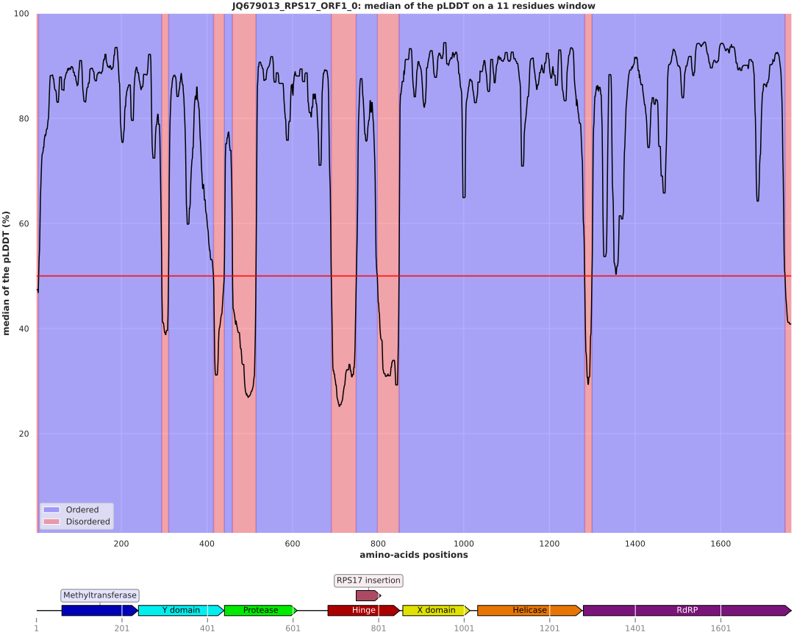

# Intrinsically Disordered Regions Alphafold

Study Intrinsically Disordered Regions (IDR) from Alphafold structures predictions using the pLDDT value, see [Mariani et al. Bioinformatics 2013](https://academic.oup.com/bioinformatics/article/29/21/2722/195896).

## Conda environment

A [conda](https://docs.conda.io/projects/conda/en/latest/index.html) YAML environment file is provided: `conda_env/idr_env.yml`. The file contains all the dependencies to run the script.
The conda environment is created using the command:
```shell script
# create the environment
conda env create -f conda_env/idr_env.yml

# activate the environment
conda activate idr
```

## Usage

The usage of the script after activating the conda environment can be displayed with:

```shell script
./idr_alphafold.py -h
```

The outputs are:
- an IDR plot from the median of the Alphafold pLDDT values from a window of residues
- an IDR CSV file

The command to launch the analysis from the `doc/data/` directory:
```shell
./idr_alphafold.py --out results --domains doc/data/JQ679013_RPS17_ORF1_domains.csv doc/data/JQ679013_RPS17_ORF1_0.pdb
```

producing the following files, `results/pLDDT_JQ679013_RPS17_ORF1_0.svg`:


and the <a href="https://github.com/njeanne/idr_alphafold/blob/main/doc/_static/pLDDT_JQ679013_RPS17_ORF1_0.csv">CSV result file</a>.
